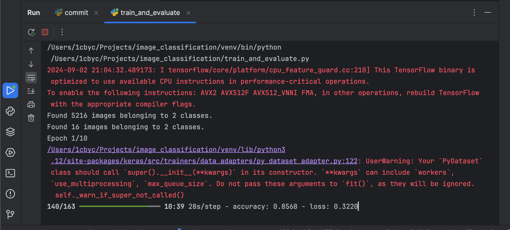

# trying to build a method to identify diseases by the way they look in xrays

1. going about this project, first thing i did was setup my env using `source venv/bin/activate` 
2. once my env is setup, i installed the requirements i decided on earlier `pip install -r requirements.txt`
3. since all that is done, i setup the method to commit my progress as it comes
4. then i mapped the directory for the project so i will start creating the subfolders for the project
5. having done that, i want to use an existing medical imaging dataset i found on kaggle. so let me use the pneumonia detection dataset first. intend to use this chest xray images for pneumonia: https://www.kaggle.com/datasets/paultimothymooney/chest-xray-pneumonia
6. currently waiting for the download, so i can place the data in the `data/train`, `data/test` and `data/val` folders of the project. so i can have all sanple images of the identifiers for the diseases ready
```markdown
i wont lie, this dataset is so large it's 2gb despite compressed to fit.
```
7. i already fixed the whole data gathering, fucking 2gb worth of images to use. anyways, i want to write a script for preprocessing the images to help apply, resize and even normalize data augmentation 
8. so i did the function to preprocess the image identified to resize, and read and then return the image. i also did the function to handle data augmentation like the zoom range, horizontal flip, all those image adjustment features. so the data_augmentation() function is to return an ImageDataGenerator instance so as to perform realtime data augmentation while training the model
9. i want to work on building and training the model. but i am having worries if i should build the CNN model from scratch or i should just transfer learning with a pre-trained model like ResNet or VGG16.
10. i decided to just transfer learning with a pre-trained model, but i am using vgg16. what i did was simply used the vgg16 model as a base and added custom layers on top for binary classification in `src/model_training.py`
11. let me now train the model since i have the model already. will just use the data i imported.
12. i am done building the model and training the model, i need to visualize the model's performance metrics at this point at least, to decide the accuracy, precision and get to plot it over all training epochs hehe.
13. wo! let me just write a script to tain and evaluate the model, let me say: `train_and_evaluate.py`
14. oh shit! i think i just messed up the whole thing. let me create another model evaluation script. i made wrong twists with the import statements especially the fact that i should not have import y_pred from `scipy.special` so let me fix that.
15. since everything wan stress me, i downloaded weights online and put it in `weights/vgg16_weights_tf_dim_ordering_tf_kernels_notop.h5`. but then, now i need to change the whole base  model in the build model function to work with path instead of direct call.
16. making matters worse, this thing no wan use .h5; it wants .keras. which kind wahala be this bai. it is like i will go and change stuff in my train_model function from `checkpoint = ModelCheckpoint('best_model.h5', monitor='val_loss', save_best_only=True)` to `checkpoint = ModelCheckpoint('best_model.keras', monitor='val_loss', save_best_only=True)`
17. finally o, result don show:

[//]: # (![Screenshot of my successful run so far]&#40;readme-images/Screenshot-2024-09-02-at-9-06-28 PM.png&#41;)

18. 